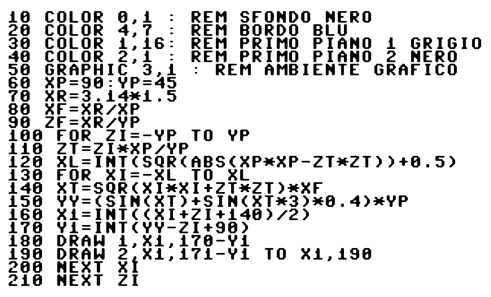

# Hat Drawing

```text/basic
10 COLOR 0,1 : REM SFOMDO HERO 
20 COLOR 4,7 : REM BORDO BLU 
30 COLOR 1,16: REM PRIMO PIANO 1 GRIGIO 
40 COLOR 2,1 : REM PRIMO PIANO 2 HERO 
50 REM GRAPHIC 3,1
60 XP=90:YP=45 
70 XR=3.14*1.5 
80 XF=XR/XP 
90 ZF=XR/YP 
100 FOR ZI=-YP TO YP 
110 ZT=ZI*XP/YP 
120 XL=INT(SQR(ABS(XP*XP-ZT*ZT))+0.5) 
130 FOR XI=-XL TO XL 
140 XT=SQR(XI*XI+ZT*ZT)*XF 
150 YY=(SIN(XT)+SIN(XT*3)*0.4)*YP 
160 X1=INT((XI+ZI+140)/2) 
170 Y1=INT(YY-ZI+90) 
180 DRAW 1,X1,170-Y1 : REM POINT 
190 DRAW 2 X1,171-Y1 TO X1,190 : REM LINE
200 NEXT XI 
210 NEXT ZI 
```

---

# Image



---

# Links

- [OCR](https://www.onlineocr.net/)
- [OCR #2](https://imgtotext.net/)
  
 